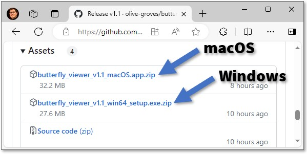

<p align="center">
  <big>
    <a href="#download-and-install">Download</a> 
    ·
    <a href="#tutorial">Tutorial</a>
    ·
    <a href="https://github.com/olive-groves/butterfly_viewer">GitHub↗</a>
  </big>
</p>

<p align="center">
  
  <br />
  <i>Sliding overlays</i>
</p>

<p align="center">
  
  <br />
  <i>Synchronized pan and zoom</i>
</p>

Butterfly Viewer is a desktop multi-image viewer with sliding overlays, synchronized pan and zoom, and other handy features to rapidly compare local image files. This can be useful for visually inspecting painting research data such as high-res and raking-light photos, X-rays, and element maps from XRF and RIS.

The Viewer runs as an [installable Windows executable](#windows-executable) or directly on its [Python source code](#python).

Most types of PNG, JPEG, and TIFF can be loaded into the Viewer. 

To accurately compare images with synchronous movement and sliding overlays in the Viewer, those images must already be registered with one another. That means their heights and widths must match, and the features within those images must be aligned. This alignment is referred to as *registration*, and you can use [Butterfly Registrator<sup>↗</sup>](https://olive-groves.github.io/butterfly_registrator) to create registered copies of your images.

# Download and install

You can download and install Butterfly Viewer to run:
- as a [Windows executable](#windows-executable); or 
- directly with [Python](#python).

## Windows executable

>[`butterfly_viewer_1.0.0_win64_setup.exe.zip`<sup>↗</sup>](https://github.com/olive-groves/butterfly_viewer/releases/latest)

For Windows, Butterfly Viewer installs to your computer with an executable (.exe) installer similar to how other programs install on your computer. The Viewer will be added to your list of programs and optionally to your desktop as a shortcut.


### Prerequisites

- The Viewer executable only runs on Windows. There's currently no support for executables for Linux or macOS.

- The Viewer uses locally stored images (like PNG, JPEG, TIFF) to create and explore views of those images. It's designed to be navigated by mouse or trackpad by clicking, dragging, and dropping.

- The Viewer doesn't use the internet, so any online images you wish to use must be locally available — for example, by downloading them or by selecting “always keep on your device” if they sync to cloud storage like OneDrive or Google Drive. Images on network shares can be loaded into the Viewer, but they can take more time to load than those stored locally, especially if accessing the share through a VPN.

### Download ZIP

Download the Viewer from the latest release of the Viewer's GitHub repo, which is packaged as an installer under *Assets* as [`butterfly_viewer_1.0.0_win64_setup.exe.zip`<sup>↗</sup>](https://github.com/olive-groves/butterfly_viewer/releases/latest).



### Extract ZIP

Extract `butterfly_viewer_1.0.0_win64_setup.exe` from the ZIP:

1. Go to the folder where you downloaded the ZIP.
2. Right-click the ZIP.
3. Select **Extract All...** or another extraction tool (like 7-Zip).


### Run installer

**Before attempting to run the installer…**

Your computer might block you from running the installer via double-click if you’re using a work computer or otherwise don’t have admin privileges:

- If you have no admin privileges, skip to [Option 2](#option-2-without-admin-privileges). 
- If you indeed have admin privileges, just follow [Option 1](#option-1-with-admin-privileges).

>*Why is it unrecognized and blocked?  In short, it’s because this installer has no certificate. If an installer's certificate isn't found by Windows when double-clicked, Windows will block it from immediately running.*

#### Option 1: With admin privileges

If you have admin privileges, run the installer by double-clicking on `butterfly_viewer_1.0.0_win64_setup.exe`:

1. Double-click on `butterfly_viewer_1.0.0_win64_setup.exe`.
2. Select **More info**.
3. Select **Run anyway**.
  <br>
  <sup>No **Run anyway**? Select **Don't run** and [try Option 2.](#option-2-without-admin-privileges)</sup>
4. Wait for the installer to load. This may take a few seconds.


#### Option 2: Without admin privileges

If double-clicking the installer doesn’t work, run the installer via the command prompt.

>*Not possible? You can try installing on a virtual machine or contacting your machine admin.*

You can find various ways online on how to run an executable (EXE) via the command prompt, but I prefer these steps:
1. Copy the path of the installer:
  - Press and hold the `Shift` key and then **right-click** the file. Wait for the menu to load.
  - Select **Copy as path**.

2. Open the Start menu  (`⊞ Win`).
3. Type **cmd**.
4. Press the `Enter` key or select the Command Prompt app.
5. Paste into the prompt the installer path you copied with `Ctrl+V`.
6. Run by pressing `Enter`. 
7. Wait for the installer to load. This may take a few seconds.

   

### Follow installer steps and install

Once the installer loads, follow the onscreen steps to install the Viewer:
- Accept the agreement. The license is [GNU GPL v3.0<sup>↗</sup>](https://www.gnu.org/licenses/gpl-3.0.en.html) or later.
- Choose to create a desktop shortcut. This can be useful to have.
- Choose the install folder. The default should be ok.
  <br>
  >*Updating with a newer version? Select the same install folder and **Install anyway**. Or first [uninstall the old version](#uninstall) and re-run the new installer if you experience problems.*

- Install.
- Finish. You can check **Launch** to verify the Viewer installed properly.

   

### Run

To run the Viewer, search for **Butterfly Viewer** in the Start menu (`⊞ Win`) or double-click on the desktop shortcut if you added it upon install.

[Follow the tutorial](#tutorial) to learn the Viewer's features.


### Uninstall

You can uninstall the Viewer executable from Windows by going to **Add or remove programs** via the Start menu, selecting **Butterfly Viewer**, and then selecting **Uninstall**. 

---

## Python

Butterfly Viewer also runs directly on its Python source code, available from its [GitHub repo<sup>↗</sup>](https://github.com/olive-groves/butterfly_viewer):

```
python butterfly_viewer.py
``` 

### Requirements

The list of dependencies are in `environment.yml` in the root directory, which includes:
- Python 3.6 (tested with Python 3.6.13) 
- PyQt 5.9 (tested with PyQt 5.9.2)

### Install and run

There are a couple ways to run the Viewer with Python. Here's one way using conda ([anaconda.org<sup>↗</sup>](https://anaconda.org/)):

1. Clone Butterfly Viewer from its [GitHub repo<sup>↗</sup>](https://github.com/olive-groves/butterfly_viewer) or simply download the source code as a ZIP and extract it.
2. Note the root directory `C:\path\to\the\butterfly_viewer\`.
3. Open Anaconda Prompt and change the directory to the root directory.

    ```
    cd C:\path\to\the\butterfly_viewer\
    ```

4. Create a new conda environment in a new subfolder named `env` using the `environment.yml` file from the root directory.

    ```
    conda env create --file environment.yml --prefix ./env
    ```

5. Activate the `env` environment.

    ```
    conda activate ./env
    ```

6. Change directory to the source subfolder.

    ```
    cd butterfly_viewer
    ```
    
6. Run Butterfly Viewer.

    ```
    python butterfly_viewer.py
    ```

---

# Tutorial

This tutorial guides you through the Butterfly Viewer's main features using a stack of sample technical images of Vincent van Gogh's *Small Pear Tree in Blossom*.

## Download sample Van Gogh images

- Download the [ZIP of sample technical images<sup>↗</sup>](https://vgm.data.surfsara.nl/index.php/s/dIIuM2cHEzJNtbP) of *Small Pear Tree in Blossom* by Vincent van Gogh, with credits to the Van Gogh Museum, Amsterdam.

- Extract the ZIP and open the folder of images.
  <br>
  <sup>How to: [Extract a ZIP](#extract-zip)</sup>


## Synchronized side-by-side images

<p align="center">
  
  <br />
  <i>Synchronized pan and zoom</i>
</p>

Let's compare individual images side-by-side with synchronous movement and discover some basic features of the Viewer along the way.

First, start the Viewer.
- If you installed the Windows executable, search for **Butterfly Viewer** in the Start menu (`⊞ Win`) or double-click on its desktop shortcut. 
<br><sup>How to: [Run installed executable](#run)</sup>
- If you're using Python, execute `python butterfly_viewer`.
<br><sup>How to: [Run on Python](#install-and-run)</sup>


We can hide the advanced features on the left because we're doing simple image comparison. 

Hide the interface by clicking .


Let's add our first image: the color photograph of *Small Pear Tree in Blossom*.

Click and drag `s0039V1962_b_crop.png` from the sample images folder into the Viewer’s main area.


Now let's add two more images to compare them: a raking light photograph and a zinc element map created using X-ray fluorescence mapping.

Click and drag these files into the Viewer:
- `s0039v1962_r2_registered_to_s0039V1962_b_crop.png`; and 
- `s0039V1962_Zn_MAXRF_registered_to_s0039V1962_b_crop.png`.


> Clicking and dragging image files directly into the Viewer creates an individual image window for each image and automatically arranges them side-by-side.


Let's change the arrangement of the image windows from a grid to a row — that is, horizontally side-by-side.

Arrange the windows horizontally by clicking .


> When arranged horizontally, image windows are shown left-to-right in the order they were created.

Zoom (scroll) and pan (left-click drag) to explore the images synchronously.


Can you find this specific blossom in the pear tree?


Try the shortcut to center and fit the image windows by clicking .


Once you're done exploring the images, close them and unhide the interface.

Close all image windows with . 

Show the interface with .


## Sliding overlays and opacity sliders

<p align="center">
  
  <br />
  <i>Sliding overlays</i>
</p>

Now let's use sliding overlays to compare the sample images we viewed side-by-side in the previous section. We'll also reveal opacity sliders and other features of the Viewer.

First, make sure the Viewer is started with the interface showing.


The 2×2 interface in the top-left corner of the Viewer lets us create an image window with a sliding overlay. 

The concept of a sliding overlay is like a before-and-after slider but in two dimensions, allowing us to place up to three images over a base image and compare their contents all at the same point by sliding the cursor up, down, left, and right.


For the base image of our first sliding overlay, we'll use the color photograph of *Small Pear Tree in Blossom*. This acts as a "ground truth" with which we can compare overlaid images.

Drag and drop `s0039v1962_b_crop.png` from the sample images into the top-left tile of the sliding overlay creator. 


The other tiles in the creator are now unlocked because a base image is present, so let's add the raking light photograph and a zinc element map.

Individually click and drag these files into the creator:
- top-right tile: `s0039v1962_r2_registered_to_s0039V1962_b_crop.png`; and 
- bottom-right tile: `s0039V1962_Zn_MAXRF_registered_to_s0039V1962_b_crop.png`.

> To accurately compare images with a sliding overlay in the Viewer, those images must already be registered with one another. That means their heights and widths must match, and the features within those images must be aligned.
> 
> The sample images here are already registered. If you want to easily create registered copies of your own images, check out [Butterfly Registrator<sup>↗</sup>](https://olive-groves.github.io/butterfly_registrator).


Now we can create a sliding overlay using the files we added.

Click Create to generate an image window with a sliding overlay.


Move your cursor across the window to change the position of the "split" of the sliding overlay. 

The split is unlocked by default, meaning it will continuously follow your cursor.


Zoom to the blossoms in the top-right of the pear tree.


The sliders in the interface in the bottom-left corner of the Viewer let us adjust the opacities of the active sliding overlay.

Since the raking light image is directly over the base color image, we can blend in the color image by decreasing the opacity of the raking light image. In other words, we can make the raking light image semi-transparent and let in the color image underneath.

Drag the opacity slider of the top-right image to about 60%.


To more easily examine the blended images, we can lock the split of the sliding overlay.

First, pan and zoom the window such that you can place the cursor at the bottom-left the brick wall. 

Lock the split at the cursor position by pressing `Shift·X` on your keyboard.


Pan and zoom to the brick wall.

Again move the opacity slider of the top-right image, this time left and right to reveal the brush strokes of Van Gogh.


Fit and center the image window.

Unlock the split by pressing `Shift·X` or by clicking Unlock Overlay.


You can also try blending the zinc element map with the color image using the opacity slider, though in the next section we'll instead use alphascale versions of the element maps (not grayscale versions) to better visualize them over the color image.

Close the image window of the sliding overlay with X in the top-right corner.

Clear the tiles of the sliding overlay creator with their respective X.


## Alphascale maps with sliding overlays

<p align="center">
  
  <br />
  <i>Alphascale maps in a sliding overlay</i>
</p>

Here we're going to use alphascale versions of the XRF element maps (not grayscale versions) to better compare them with the color photo of *Small Pear Tree in Blossom* in a sliding overlay, which we introduced in the previous section. We'll also cover some more features.

> If you want to create alphascale versions of your own grayscale maps, check out [Butterfly Registrator<sup>↗</sup>](https://olive-groves.github.io/butterfly_registrator).

First, make sure the Viewer is started with the interface showing.


We'll again use the color photograph of *Small Pear Tree in Blossom* as the base image of the sliding overlay.

Then we'll add the alphascale versions of the bromine, chromium, and zinc element maps included in the sample images.

Individually click and drag these files into the creator, and then click Create:
- top-left (base) tile: `s0039V1962_b_crop.png`;
- top-right tile: `s0039V1962_Br_MAXRF_alphascale_rgb_255_0_0_registered_to_s0039V1962_b_crop.png`;  
- bottom-right tile: `s0039V1962_Cr_MAXRF_alphascale_rgb_0_255_0_registered_to_s0039V1962_b_crop.png`; and
- bottom-left tile: `s0039V1962_Zn_MAXRF_alphascale_rgb_255_255_255_registered_to_s0039V1962_b_crop.png`.


If you want to quickly see each element map as a whole over the color image, you can use the interface grid of buttons in the bottom-left of the Viewer to temporarily move the sliding overlay to the edges of the image window.

Hover over (don't click!) the split shortcut arrows to temporarily move the split.


By reducing the opacity of the base color image — in other words, by making the base image semi-transparent — we can make the colors of the alphascale maps "pop" and as a result make it easier to see where their respective elements are present in *Small Pear Tree in Blossom*.

Drag the opacity slider of the base image to about 40%.


Can you find this area in the painting?


The Viewer can handle multiple simultaneous image windows with individual images and sliding overlays, all while synchronizing panning and zooming. But if you want, you turn off the sync (unsync) of the windows.

Can you create a set of image windows like this?


Once finished, close the Viewer.

---

# Help!

## My images are unequally zoomed with sync enabled


The Viewer is working as intended! 

When synced, the zoom level in all image windows is set such that the size of a given pixel is the same  across all images. In other words, if you sync an Image A of 1000px × 1000px with an Image B of 500px × 500px, Image B will then appear smaller compared to A because B is half its size. This can give the impression that B is "zoomed out" compared to A.

**Remember: Images must be registered** to properly compare them with synchronous features and sliding overlays in the Viewer. This means the images must have identical resolutions with their features aligned. You can use the [Butterfly Registrator<sup>↗</sup>](https://olive-groves.github.io/butterfly_registrator) to register images to one another.

---